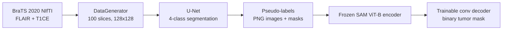

# SAM-Net: U-Net + Segment Anything for Brain Tumor Segmentation

A two-stage brain tumor segmentation pipeline on BraTS 2020 MRI: a U-Net produces pseudo-labels, and a decoder trained on those labels runs on top of a frozen Segment Anything (SAM) encoder.

## Overview

Segmenting tumor sub-regions in multi-modal MRI usually needs a lot of expert annotation. This project first trains a 2D U-Net (TensorFlow/Keras) on BraTS 2020 FLAIR and T1CE slices to predict four classes (background, necrotic/non-enhancing core, edema, enhancing tumor). The trained U-Net then labels slices, and those pseudo-labels are used to train a lightweight convolutional decoder on top of a frozen, pretrained SAM ViT-B image encoder (PyTorch). The code was written to run on an HPC GPU cluster.

## What's inside

- **U-Net baseline**: 4-level encoder/decoder (32 to 512 filters), 2-channel input (FLAIR + T1CE) at 128x128, 4-class softmax output.
- **Slice-based data generator**: loads NIfTI volumes with `nibabel`, takes 100 axial slices starting at slice 22, resizes them, and remaps BraTS label 4 to 3.
- **Segmentation metrics**: Dice (overall and per class: necrotic, edema, enhancing), mean IoU, precision, sensitivity and specificity as Keras metrics.
- **Pseudo-label generation**: U-Net predictions are saved as PNG image/mask pairs to build a dataset for the SAM stage.
- **SAM decoder**: a frozen SAM `vit_b` image encoder with a small trainable conv head, trained with BCE loss for binary tumor masks and reporting Dice, IoU and pixel accuracy.
- **Reproducible environments**: pinned requirements files for a current stack and for CUDA 11 clusters.

## Tech stack

Python, TensorFlow/Keras, PyTorch/torchvision, Meta's [Segment Anything](https://github.com/facebookresearch/segment-anything), nibabel/nilearn, OpenCV, scikit-learn, NumPy/pandas, Kaggle API.

## How it works



1. **Phase 1**: train the U-Net on BraTS training cases. It uses categorical cross-entropy, Adam (lr 1e-3), `ReduceLROnPlateau`, CSV logging to `training.log`, and checkpointing.
2. **Phase 2**: run the U-Net over the patient volumes and write FLAIR slices and predicted masks to `data/working/dataset/{images,masks}`.
3. **Phase 3**: resize the images to 1024x1024, pass them through the frozen SAM encoder, and train the decoder head on the binarized pseudo-label masks.

## Repository structure

```
SAM-NET/
├── readable-sam-net.py                 # Cleaned-up, function-based pipeline (main entry point)
├── sam_net_implementation.py           # Original notebook export (Kaggle paths)
├── sam_net_implementation.modified.py  # Notebook export adapted for local/HPC paths
├── modifications.patch                 # Diff from the original export to the modified version
├── download_data.py                    # Downloads the dataset bundle from Kaggle
├── .env.example                        # Kaggle credential template
├── requirements.txt                    # Current stack (TF 2.15, PyTorch 2.2)
├── requirements.modified*.txt          # Older pinned stacks, including CUDA 11 variants
└── training.log                        # CSV log from a U-Net training run
```

## Getting started

### 1. Install dependencies

```bash
python -m venv venv
source venv/bin/activate
pip install -r requirements.txt
# On a CUDA 11 cluster, use one of these instead:
# pip install -r requirements.modified_cu11.txt
# pip install -r requirements.modified_absolute_cu11.txt   # fully pinned
```

### 2. Configure Kaggle credentials

Copy the template and fill in your [Kaggle API](https://www.kaggle.com/docs/api) username and key:

```bash
cp .env.example .env
```

`download_data.py` reads `KAGGLE_USERNAME` and `KAGGLE_KEY` from `.env`.

### 3. Download the data

```bash
python download_data.py
```

This downloads the Kaggle dataset `clivelewis14/sam-net-hpc` into `data/` (the folder is git-ignored). The scripts expect this layout:

```
data/
├── BRATS/BraTS2020_TrainingData/MICCAI_BraTS2020_TrainingData/
├── BRATS/BraTS2020_ValidationData/MICCAI_BraTS2020_ValidationData/
├── UNET/                                   # U-Net weights/checkpoints
└── segment-anything-pytorch-vit-b-v1/model.pth
```

### 4. Run the pipeline

```bash
python readable-sam-net.py
```

By default `main()` runs in HPC mode: the full training set, 35 U-Net epochs and 10 SAM-decoder epochs. For a quick smoke test on a couple of patients, call `main("local")` in the `__main__` block. A GPU is strongly recommended.

## Results

`training.log` holds the Keras CSV log from one U-Net epoch (epoch 0): training accuracy 0.574, training mean IoU 0.455, validation loss 0.841, validation mean IoU 0.375. This was a short verification run, not a tuned benchmark.

## Author

**Dhruv Joshi**: [GitHub](https://github.com/DJCodesStuff) | [Portfolio](https://djcodesstuff.github.io/)
